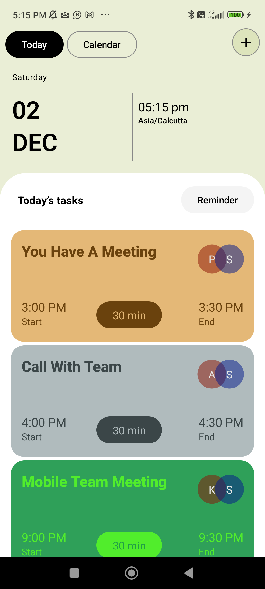

# Scheduler
Learning Jetpack compose

A few days ago, I showcased a design in an Instagram post. Inspired by that, I decided to embark on a self-imposed challenge to bring this UI to life.  
Download the latest APK [here](https://github.com/Suraj820/Scheduler/actions/runs/7363841064/artifacts/1140255792).   

 

